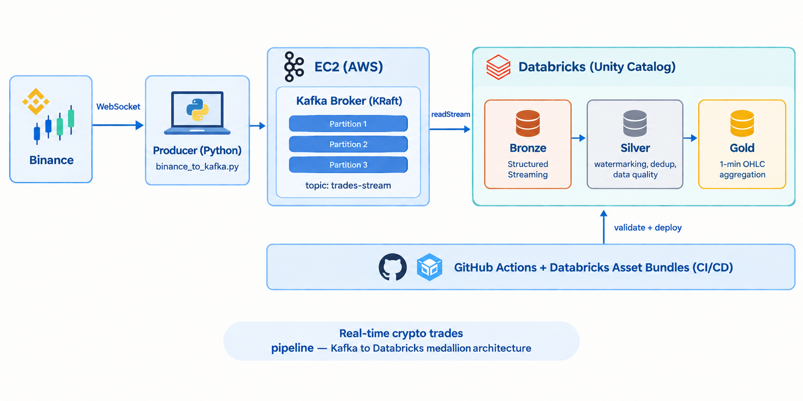
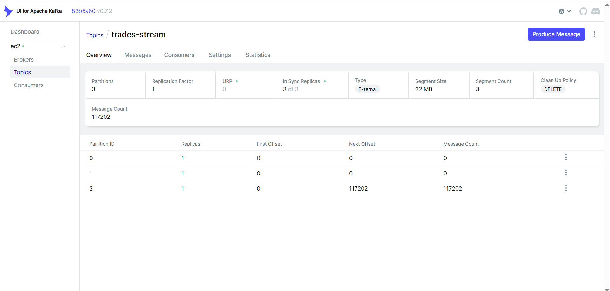
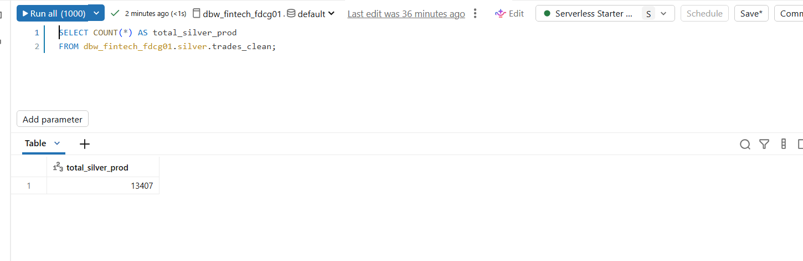
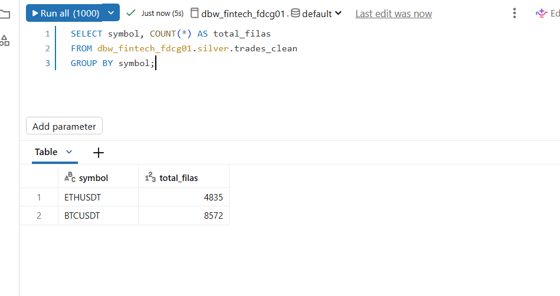
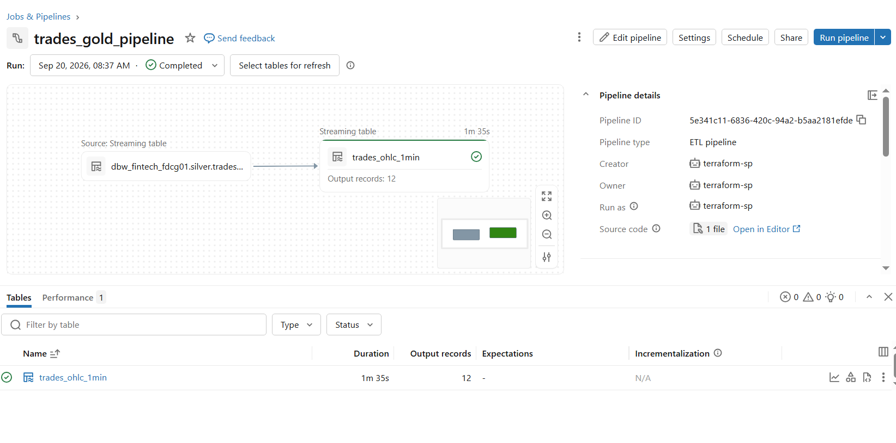
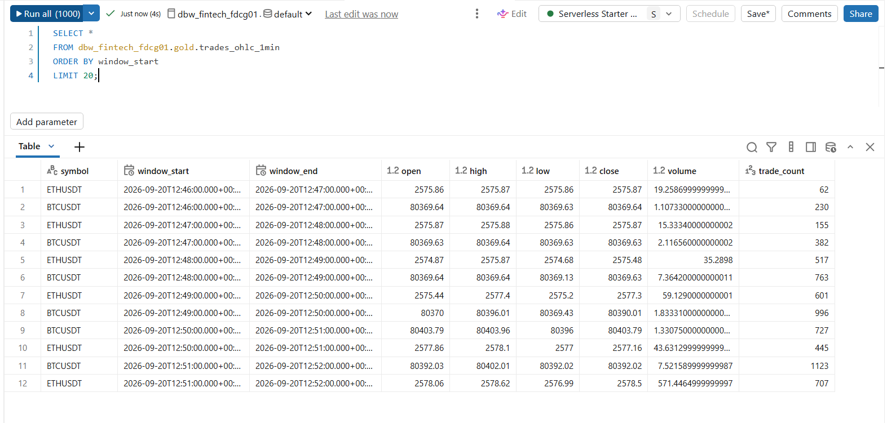
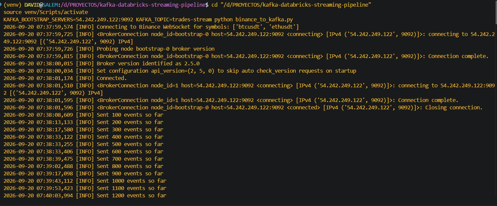
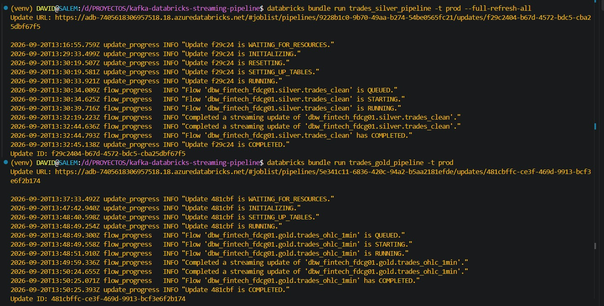

# Kafka Streaming Pipeline → Databricks (Bronze / Silver / Gold)

Real-time streaming pipeline: Binance trades (BTCUSDT, ETHUSDT) via WebSocket
→ self-hosted Apache Kafka on EC2 → Databricks (Structured Streaming + Delta
Live Tables), with a full medallion architecture and CI/CD for dev and
production environments.

## Architecture



<details>
<summary>View as ASCII diagram</summary>

```
Binance (WebSocket)
       │
       ▼
Local producer (binance_to_kafka.py)
       │
       ▼
┌─────────────────────────────────────┐
│ EC2 (AWS)                            │
│  Kafka broker (KRaft mode)           │
│  topic: trades-stream, 3 partitions  │
└─────────────────────────────────────┘
       │ readStream
       ▼
┌───────────────────────────────────────────────────┐
│ Databricks (Unity Catalog)                         │
│                                                     │
│  Bronze ──▶ Silver ──▶ Gold                        │
│  (classic       (DLT:        (DLT:                 │
│  Structured     watermarking  1-minute OHLC         │
│  Streaming      + dedup +     aggregation,          │
│  job)           data quality) per symbol)           │
└───────────────────────────────────────────────────┘
       ▲
       │ validate + deploy
GitHub Actions (CI/CD) — Databricks Asset Bundles
```

</details>

Each layer lives in its own Unity Catalog schema, distinct between `dev` and
`prod` (see [Environment configuration](#environment-configuration)).

## Why this architecture

- **Self-hosted Kafka on EC2, not a managed service**: this practice project
  prioritized understanding Kafka's internal mechanics (partitions,
  replicas, offsets, brokers) instead of delegating that to a managed
  service like MSK or Event Hub from the start. In a real production
  setting, a managed service would be the default choice.
- **Classic cluster for Bronze, not serverless**: the native Kafka connector
  for Structured Streaming ships with the classic Databricks Runtime,
  enabling real `readStream`/`writeStream` with genuine watermarking and
  checkpointing — unlike an earlier Event Hub project on serverless compute,
  where that connector wasn't available and a manual Python loop was used
  instead.
- **Silver and Gold as separate Delta Live Tables pipelines**, decoupled from
  the Bronze job: DLT automatically manages checkpoints, retries, and
  table lineage — a better fit for declarative transformations than another
  manual `readStream`/`writeStream` job.
- **Silver and Gold in separate pipelines**, each with its own schema
  (`silver`, `gold`), so lineage and permissions per layer stay clearly
  scoped.

## Core concepts demonstrated

Quick reference — see [Concepts explained](#concepts-explained) below for
what each one actually means and why it's used.

| Concept | Where it's applied |
|---|---|
| Partitioning and parallelism | Topic `trades-stream`, partitioned by `symbol` |
| Checkpointing | Explicit `checkpointLocation` in Bronze; automatic per-table in DLT (Silver/Gold) |
| Watermarking | `withWatermark("trade_timestamp", "2 minutes")` in Silver and Gold |
| Streaming deduplication | `dropDuplicatesWithinWatermark` in Silver |
| Declarative data quality | `@dlt.expect_or_drop` / `@dlt.expect_or_fail` in Silver |
| Windowed aggregation | 1-minute OHLC per symbol in Gold |
| Environment-aware CI/CD | GitHub Actions + Databricks Asset Bundles, `dev` (auto-deploy on push) and `prod` (only on `main`) |

## Concepts explained

The table below said *where* each concept is used. This section explains
*what it is* and *why it matters* — the part that actually gets asked about
in interviews.

### Partitioning & parallelism

A Kafka topic is split into partitions — independent, ordered logs. Splitting
`trades-stream` into 3 partitions serves two purposes: it lets multiple
consumers process the topic in parallel (each partition can be read by a
different consumer within a consumer group), and it guarantees strict
ordering **within** a partition, though not **across** partitions. This
project partitions by `symbol`, so every BTCUSDT trade lands in the same
partition and arrives in the exact order it occurred — but there's no
ordering guarantee between BTCUSDT and ETHUSDT trades relative to each
other, since they may live in different partitions.

### Replication

Separate from partitioning: replication is about having redundant copies of
each partition on different brokers, for fault tolerance. This project runs
`replication-factor 1` — a direct consequence of running a single broker;
Kafka cannot place more replicas than there are brokers available. In a
multi-broker setup, each partition would have one broker acting as **leader**
(handling reads/writes) and the others as **followers** (passive copies),
with the leader role assigned per-partition, not per-broker — so a 3-broker,
3-partition, replication-factor-3 cluster has every broker acting as leader
for one partition and follower for the other two simultaneously.

### Offsets

Every message written to a partition gets a sequential integer (its offset)
based purely on write order — not on any timestamp inside the message
payload. Reading a message never deletes it; a consumer just advances its
own offset pointer. This is what makes replay possible: setting
`startingOffsets: earliest` re-reads the full retained history from offset
0, because the data was never removed by being read.

### Checkpointing

Checkpointing is what makes a streaming job resumable without data loss or
duplication after a restart or failure. In the Bronze job, it's explicit:
`checkpointLocation` points to a Unity Catalog Volume, and Spark atomically
records, for every micro-batch, both which Kafka offsets were read and what
was written to Delta — so a restart resumes exactly where it left off. In
Silver and Gold (Delta Live Tables), checkpointing is **not** manually
configured: each `@dlt.table` gets its own checkpoint managed internally by
the DLT engine, inspectable from the pipeline's Event Log in the UI rather
than from a file path.

### Watermarking

Watermarking answers the question: *how long should Spark wait for
late-arriving data before considering a time window "closed"?* It's
declared as `withWatermark("trade_timestamp", "2 minutes")` — using
**event-time** (when the trade actually happened on Binance), not
processing-time (when Spark saw it), because network delays shouldn't change
which window a trade logically belongs to.

The watermark itself is computed purely from the data seen so far, not from
the wall clock:

```
watermark = (max event-time seen so far) − 2 minutes
```

It only ever moves forward. Any event whose `trade_timestamp` is older than
the current watermark is silently dropped — not because the data is
invalid, but because Spark has already closed and freed the memory for that
time window. Without a watermark, Spark would have to keep deduplication and
aggregation state in memory forever, since it would never know when it's
safe to discard old state — eventually exhausting cluster memory. This is
also why watermarking is what makes `dropDuplicatesWithinWatermark` and
windowed `groupBy` aggregations possible at all in streaming mode: Spark
refuses to run an unbounded streaming aggregation without one.

### Windowed aggregation

Gold's `trades_ohlc_1min` groups Silver's output into 1-minute tumbling
windows per symbol, computing open/high/low/close/volume — the classic
market-data aggregation pattern. This only works because Silver's watermark
already bounds how long a window stays "open" for late data; Gold declares
its own watermark on the same column for the same reason: each streaming
aggregation stage needs to know independently when it's safe to emit a
window as final.

## Bundle & CI/CD configuration explained

### `databricks.yml`

- **`variables`**: each has a `default` (used unless overridden). Two are
  left **without** a default on purpose — `kafka_bootstrap_servers` and
  `existing_cluster_id` — because they're environment-specific and must be
  supplied explicitly (`BUNDLE_VAR_*` env vars locally, GitHub Secrets in
  CI), rather than risk a stale hardcoded value being silently reused.
- **`bronze_schema` / `silver_schema` / `gold_schema`**: each has a general
  default, then is **overridden per target** under `targets.dev.variables`
  and `targets.prod.variables`. This is the single mechanism that keeps dev
  and prod fully isolated — same code, different schema names, no
  duplicated files.
- **`starting_offsets`**: `earliest` in dev (there's already a generated
  history worth reprocessing), `latest` in prod (avoid re-ingesting the
  entire backlog on first deploy, which would be wasteful and slow).
- **`targets.prod.workspace.root_path`**: an explicit path under the
  deploying user's workspace folder — required because `terraform-sp` (the
  CI/CD service principal) deploys as itself, not as a human user with a
  default home folder.
- **`include: - resources/*.yml`**: a wildcard, not a manual list — any new
  file dropped into `resources/` is picked up automatically on the next
  deploy, without editing this file.

### `resources/streaming.yml` (Bronze — a Job)

- **`continuous: pause_status: PAUSED`**: the job is defined as continuous
  streaming (it would restart itself indefinitely if enabled), but starts
  paused on purpose — deploying the bundle never auto-starts consumption of
  Kafka; it's always triggered manually.
- **`existing_cluster_id`**: reuses an already-provisioned interactive
  cluster instead of spinning up a new one per run — this is also why that
  cluster's compute keeps running after the job finishes, and must be
  stopped manually (or relies on its own auto-termination setting).
- **`base_parameters`**: the widget values injected into the notebook at run
  time — this is how the exact same notebook file behaves differently in
  dev vs. prod, without any code change.

### `resources/dlt_pipeline_silver.yml` / `dlt_pipeline_gold.yml` (Silver/Gold — DLT pipelines)

- **`catalog` / `target`**: which Unity Catalog schema this pipeline writes
  to — pulled from bundle variables, so the same YAML deploys to
  `dev_silver` or `silver` depending on target.
- **`continuous: false`**: triggered mode — the pipeline runs once over
  whatever is currently available upstream, then stops and releases its
  cluster on its own. No idle compute risk, unlike the Bronze job.
- **`clusters` block (`node_type_id`, `num_workers: 0`,
  `spark_conf`/`custom_tags` for single-node)**: DLT provisions its own
  cluster by default, and its auto-selected VM size is not guaranteed to
  match what's available in a given Azure subscription's quota. Pinning
  `node_type_id` to a size already proven available (matching the existing
  interactive cluster) and running single-node keeps cost and quota risk
  minimal for this data volume.
- **`configuration` block (`bronze_catalog`/`bronze_schema` for Silver,
  `upstream_silver_catalog`/`upstream_silver_schema` for Gold)**: these are
  read inside the notebook via `spark.conf.get(...)`, not hardcoded table
  names — this is what lets the same Silver/Gold notebooks correctly find
  `dev_silver.trades_clean` in dev and `silver.trades_clean` in prod without
  any code branching.

### CI/CD workflows

**`ci-cd-dev.yml`** — triggers on every push, any branch. Runs
`databricks bundle validate -t dev` then `databricks bundle deploy -t dev`.
Deploying only uploads files and registers/updates job and pipeline
*definitions* — it never runs anything, so no compute is spun up by CI/CD
itself.

**`ci-cd-prod.yml`** — triggers **only** on push to `main`, intentionally
different from dev's every-push trigger, so a feature branch push can never
accidentally touch production. Same two steps (`validate` + `deploy`), same
"definitions only, nothing executed" behavior, but authenticated as the
`terraform-sp` service principal via the `ARM_CLIENT_ID` /
`ARM_CLIENT_SECRET` / `ARM_TENANT_ID` / `ARM_SUBSCRIPTION_ID` GitHub
Secrets — never as a personal user account.

Running the actual jobs/pipelines after either workflow completes is always
a separate, manual step (`databricks bundle run ...`), by design — this is
what keeps cloud spend under direct control instead of tied to every git
push.

## Repository structure

```
.
├── databricks.yml                 # Bundle: variables and targets (dev/prod)
├── docker-compose-ec2.yml         # Kafka (KRaft) + Kafka UI, deployed to EC2
├── setup_kafka.sh                 # Local Kafka + topic bootstrap script
├── binance_to_kafka.py            # Producer: Binance WebSocket → Kafka
├── requirements.txt
├── notebooks/
│   ├── bronze_streaming_kafka_consumer.py   # Structured Streaming job (Bronze)
│   ├── silver_trades_dlt.py                 # DLT pipeline (Silver)
│   ├── gold_trades_dlt.py                   # DLT pipeline (Gold)
│   └── demo_watermarking.py                 # Practice notebook, isolated from real tables
├── resources/
│   ├── streaming.yml              # Bronze job definition
│   ├── dlt_pipeline_silver.yml    # Silver DLT pipeline definition
│   └── dlt_pipeline_gold.yml      # Gold DLT pipeline definition
├── terraform/                     # Documented IaC — see note below
├── docs/images/                   # Evidence screenshots referenced in this README
└── .github/workflows/
    ├── ci-cd-dev.yml               # Validates and deploys to dev on every push
    └── ci-cd-prod.yml              # Validates and deploys to prod only on push to main
```

## Environment configuration

| Variable | dev | prod |
|---|---|---|
| `bronze_schema` | `kafka_bronze` | `bronze` |
| `silver_schema` | `dev_silver` | `silver` |
| `gold_schema` | `dev_gold` | `gold` |
| `starting_offsets` | `earliest` (reprocess the already-generated history) | `latest` (avoid reprocessing the full backlog) |

## Manual setup required before first deploy (per environment)

Unity Catalog does **not** auto-create schemas or volumes just because a job
or DLT pipeline references them. These steps must be run manually, once,
before the first `bundle run` in each new environment.

### 1. Create the schemas

```sql
-- dev
CREATE SCHEMA IF NOT EXISTS dbw_fintech_fdcg01.kafka_bronze;
CREATE SCHEMA IF NOT EXISTS dbw_fintech_fdcg01.dev_silver;
CREATE SCHEMA IF NOT EXISTS dbw_fintech_fdcg01.dev_gold;

-- prod
CREATE SCHEMA IF NOT EXISTS dbw_fintech_fdcg01.bronze;
CREATE SCHEMA IF NOT EXISTS dbw_fintech_fdcg01.silver;
CREATE SCHEMA IF NOT EXISTS dbw_fintech_fdcg01.gold;
```

### 2. Create the checkpoint volume (Bronze only)

Structured Streaming's `checkpointLocation` needs a real Unity Catalog
Volume — public DBFS paths (`/tmp/...`) are disabled on this workspace.

```sql
CREATE VOLUME IF NOT EXISTS dbw_fintech_fdcg01.kafka_bronze.checkpoints; -- dev
CREATE VOLUME IF NOT EXISTS dbw_fintech_fdcg01.bronze.checkpoints;       -- prod
```

### 3. Grant permissions to the CI/CD service principal

The `prod` deploy runs as a service principal (`terraform-sp`, driven by the
`ARM_CLIENT_ID`/`ARM_CLIENT_SECRET` GitHub secrets), which is a **separate
identity** from the human user who creates the schemas above. It needs its
own explicit grants, or every job/pipeline run fails with
`INSUFFICIENT_PERMISSIONS` / `PERMISSION_DENIED`, even though the schemas
already exist.

```sql
GRANT USE CATALOG ON CATALOG dbw_fintech_fdcg01 TO `terraform-sp`;

GRANT USE SCHEMA, CREATE TABLE ON SCHEMA dbw_fintech_fdcg01.bronze TO `terraform-sp`;
GRANT USE SCHEMA, CREATE TABLE ON SCHEMA dbw_fintech_fdcg01.silver TO `terraform-sp`;
GRANT USE SCHEMA, CREATE TABLE ON SCHEMA dbw_fintech_fdcg01.gold TO `terraform-sp`;

GRANT READ VOLUME, WRITE VOLUME ON VOLUME dbw_fintech_fdcg01.bronze.checkpoints TO `terraform-sp`;
```

If `GRANT ... TO `terraform-sp`` fails with `PRINCIPAL_DOES_NOT_EXIST` (SQL
sometimes doesn't resolve service principals by display name), grant it
from the UI instead: **Catalog Explorer → schema → Permissions → Grant →
search by name**, which resolves it correctly.

### 4. Grant yourself read access, separately

Even as the workspace admin, your own user does **not** automatically get
`SELECT` on tables created by the service principal — that's also a
separate grant:

```sql
GRANT SELECT ON TABLE dbw_fintech_fdcg01.bronze.trades_raw_kafka TO `<your-email>`;
```

(Or grant `SELECT` at the schema level to `All account users` to avoid
repeating this per table.)

## Kafka broker — full installation reference (reusable)

This is the exact sequence used to provision Kafka on a fresh EC2 instance,
kept here so a future project can replicate it without re-deriving each
step.

### 1. EC2 instance

- Ubuntu 22.04, instance type `t3.medium` (or similar — light workload)
- Security Group: inbound TCP 9092 (broker), 8090 (Kafka UI), 22 (SSH)

### 2. Install Docker

```bash
sudo apt-get update
sudo apt-get install -y docker.io docker-compose-plugin
sudo systemctl enable docker
sudo systemctl start docker
```

### 3. `docker-compose-ec2.yml` (KRaft mode, no Zookeeper)

```yaml
services:
  kafka:
    image: apache/kafka:latest
    ports:
      - "9092:9092"
    environment:
      KAFKA_NODE_ID: 1
      KAFKA_PROCESS_ROLES: broker,controller
      KAFKA_LISTENERS: PLAINTEXT://kafka:29092,PLAINTEXT_HOST://0.0.0.0:9092,CONTROLLER://kafka:29093
      KAFKA_ADVERTISED_LISTENERS: PLAINTEXT://kafka:29092,PLAINTEXT_HOST://<EC2_PUBLIC_IP>:9092
      KAFKA_CONTROLLER_QUORUM_VOTERS: 1@kafka:29093
      KAFKA_LISTENER_SECURITY_PROTOCOL_MAP: CONTROLLER:PLAINTEXT,PLAINTEXT:PLAINTEXT,PLAINTEXT_HOST:PLAINTEXT
      KAFKA_CONTROLLER_LISTENER_NAMES: CONTROLLER
      KAFKA_INTER_BROKER_LISTENER_NAME: PLAINTEXT
  kafka-ui:
    image: provectuslabs/kafka-ui:latest
    ports:
      - "8090:8080"
    environment:
      KAFKA_CLUSTERS_0_NAME: ec2
      KAFKA_CLUSTERS_0_BOOTSTRAPSERVERS: kafka:29092
    depends_on:
      - kafka
```

**The most commonly misconfigured line is `KAFKA_ADVERTISED_LISTENERS`** —
`PLAINTEXT_HOST` must carry the EC2's actual public IP, not `localhost` and
not `0.0.0.0`, or external clients (the producer, Databricks) will fail to
connect even though the container is running fine internally.

### 4. Start the broker

```bash
cd ~/kafka-streaming
docker compose -f docker-compose-ec2.yml up -d
```

### 5. Create the topic

```bash
docker exec kafka /opt/kafka/bin/kafka-topics.sh \
  --create --topic trades-stream \
  --partitions 3 --replication-factor 1 \
  --bootstrap-server localhost:9092
```

### 6. Verify

```bash
docker exec kafka /opt/kafka/bin/kafka-topics.sh \
  --describe --topic trades-stream --bootstrap-server localhost:9092
```

### Note: no persistent volume configured

This setup does **not** mount a persistent Docker volume for Kafka's data
directory. If the containers are recreated (`docker compose down` followed
by `up`), the topic and all its messages are lost. For a version of this
setup meant to survive restarts, add a named volume for
`/var/lib/kafka/data` in the compose file.

## Kafka connection reference (reusable for future projects)

This section documents exactly how the Kafka broker was set up and connected
to, so this project can be cloned as a starting point for future streaming
work without re-deriving these steps from scratch.

### 1. Broker setup on EC2

Kafka runs via Docker Compose (`docker-compose-ec2.yml`), in KRaft mode (no
Zookeeper). Key environment variable:

```yaml
KAFKA_ADVERTISED_LISTENERS: PLAINTEXT://kafka:29092,PLAINTEXT_HOST://<EC2_PUBLIC_IP>:9092
```

This is the setting most commonly misconfigured: `PLAINTEXT_HOST` must
advertise the EC2's **public** IP so that external clients (the local
producer, Databricks) can resolve the broker correctly. `PLAINTEXT` (port
29092) is the internal, container-to-container listener, used by Kafka UI.

Bring the broker up / down from a machine with SSH access configured (see
`~/.ssh/config` alias pattern below):

```bash
ssh <ec2-alias> "cd ~/kafka-streaming && docker compose up -d"
ssh <ec2-alias> "cd ~/kafka-streaming && docker compose down"
```

### 2. Topic creation

```bash
docker exec kafka /opt/kafka/bin/kafka-topics.sh \
  --create --topic trades-stream \
  --partitions 3 --replication-factor 1 \
  --bootstrap-server localhost:9092
```

`replication-factor 1` is a consequence of running a single broker — Kafka
cannot place more replicas than there are brokers available. With multiple
brokers, this would be raised to 3 for real fault tolerance.

### 3. Producer connection

`binance_to_kafka.py` connects using `kafka-python`, with the broker's
public address passed via environment variable — never hardcoded, since the
EC2's public IP changes on instance restart (no Elastic IP was attached):

```bash
KAFKA_BOOTSTRAP_SERVERS=<ec2-ip>:9092 KAFKA_TOPIC=trades-stream python binance_to_kafka.py
```

Messages are partitioned by `key=event["symbol"]`, so all trades for a given
symbol land in the same partition and preserve order relative to each other.

### 4. Databricks connection

The Bronze notebook connects with the exact same bootstrap address, passed
as a widget/bundle variable rather than hardcoded:

```python
raw_stream = (
    spark.readStream
    .format("kafka")
    .option("kafka.bootstrap.servers", kafka_bootstrap_servers)
    .option("subscribe", kafka_topic)
    .option("startingOffsets", starting_offsets)
    .load()
)
```

No manual JAR installation is needed — the Kafka connector
(`org.apache.spark:spark-sql-kafka-0-10`) ships built into the classic
Databricks Runtime.

### 5. SSH alias pattern (optional, for convenience)

To avoid retyping the IP, user, and key path on every connection, an SSH
config alias was used:

```
# ~/.ssh/config
Host <ec2-alias>
    HostName <ec2-public-ip>
    User ubuntu
    Port 22
    IdentityFile ~/.ssh/<key-name>.pem
    ServerAliveInterval 60
    ServerAliveCountMax 10
```

## Evidence

### Kafka broker — topic with 3 partitions



### Silver layer (prod) — row count after full pipeline run





### Gold layer (prod) — pipeline completed



### Gold layer (prod) — sample OHLC output



### Producer — connecting and streaming to Kafka



### Silver + Gold pipelines — full run log (prod)

This terminal output shows the complete lifecycle for both DLT pipelines in
one continuous session: Silver reaching `COMPLETED`, immediately followed by
Gold being triggered and also reaching `COMPLETED`, with matching pipeline
and update IDs.



<!--
TODO: still to capture and add here —
- Bronze (prod) row count query result
- GitHub Actions ci-cd-prod run, green checkmark
-->

## How to run it

```bash
export BUNDLE_VAR_kafka_bootstrap_servers="<ec2-ip>:9092"
export BUNDLE_VAR_existing_cluster_id="<cluster-id>"

databricks bundle deploy -t dev
databricks bundle run trades_streaming_job -t dev --no-wait   # Bronze (job, continuous)
databricks bundle run trades_silver_pipeline -t dev            # Silver (DLT)
databricks bundle run trades_gold_pipeline -t dev               # Gold (DLT)
```

DLT pipelines use `continuous: false` (triggered mode): they run once and
stop on their own, without idling compute. The Bronze job is continuous
streaming and must be canceled manually from the Databricks UI when done.


## Known follow-ups

- Restrict the EC2 Security Group (ports 9092/8090) to Databricks' real
  outbound IP, instead of `0.0.0.0/0`.
- Consider replication factor > 1 if the project moves to multiple brokers.
- Chain Bronze → Silver → Gold with Databricks Workflows dependencies,
  instead of triggering each manually in sequence.